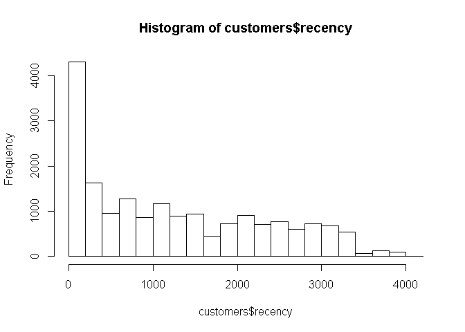
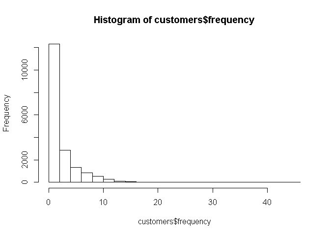
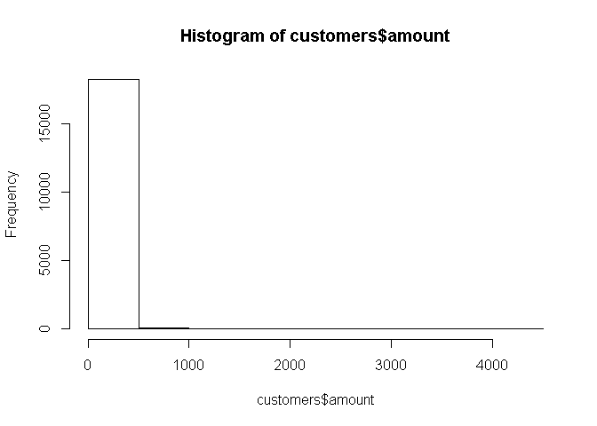
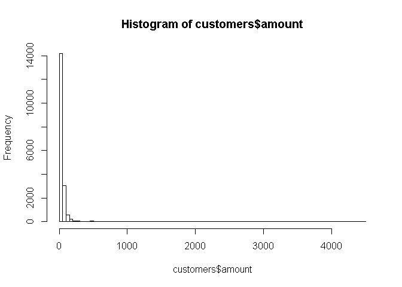
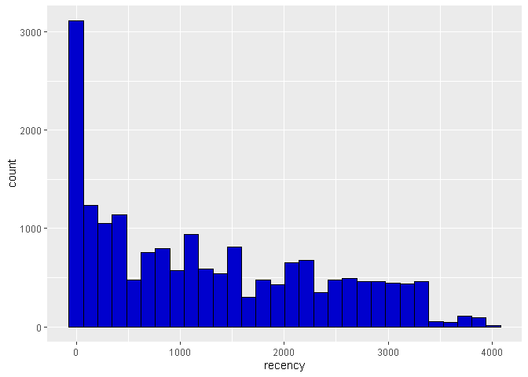
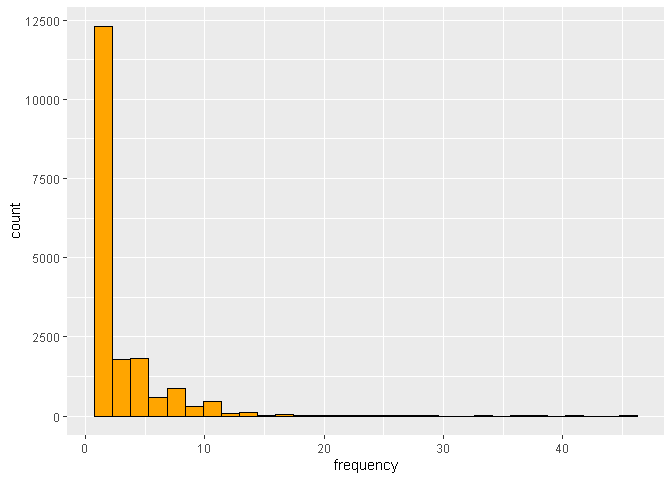
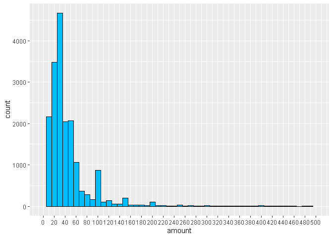
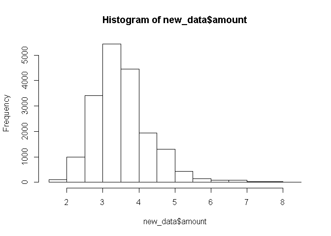
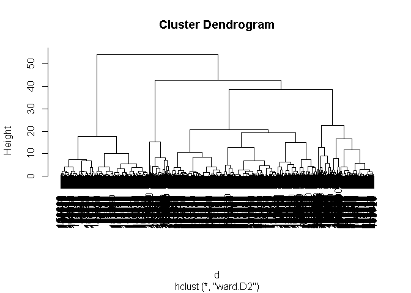

### — COMPUTING RECENCY, FREQUENCY, MONETARY VALUE ———

### Loading the dataset

``` r
data = read.delim(file = 'purchases.txt', header = FALSE, sep = '\t', dec = '.')
```

#### Display the data before transformation

``` r
head(data)
```

    ##     V1  V2         V3
    ## 1  760  25 2009-11-06
    ## 2  860  50 2012-09-28
    ## 3 1200 100 2005-10-25
    ## 4 1420  50 2009-07-09
    ## 5 1940  70 2013-01-25
    ## 6 1960  40 2013-10-29

``` r
str(data)
```

    ## 'data.frame':    51243 obs. of  3 variables:
    ##  $ V1: int  760 860 1200 1420 1940 1960 2620 3050 3120 3260 ...
    ##  $ V2: num  25 50 100 50 70 40 30 50 150 45 ...
    ##  $ V3: Factor w/ 1879 levels "2005-01-02","2005-01-04",..: 668 1099 93 622 1160 1319 121 251 173 798 ...

### Transforming the dataset

#### Add headers and interpret the last column as a date, extract year of purchase

``` r
colnames(data) = c('customer_id', 'purchase_amount', 'date_of_purchase')
data$date_of_purchase = as.Date(data$date_of_purchase, "%Y-%m-%d")
data$days_since       = as.numeric(difftime(time1 = "2016-01-01",
                                            time2 = data$date_of_purchase,
                                            units = "days"))
```

Function difftime calculates a difference of two date/time.

### Exploring the transformed dataset

#### Dataset size

``` r
dim(data)
```

    ## [1] 51243     4

##### Display the data after transformation

``` r
head(data)
```

    ##   customer_id purchase_amount date_of_purchase days_since
    ## 1         760              25       2009-11-06  2247.2083
    ## 2         860              50       2012-09-28  1190.2083
    ## 3        1200             100       2005-10-25  3720.2083
    ## 4        1420              50       2009-07-09  2367.2083
    ## 5        1940              70       2013-01-25  1071.2083
    ## 6        1960              40       2013-10-29   794.2083

``` r
summary(data)
```

    ##   customer_id     purchase_amount   date_of_purchase       days_since      
    ##  Min.   :    10   Min.   :   5.00   Min.   :2005-01-02   Min.   :   1.208  
    ##  1st Qu.: 57720   1st Qu.:  25.00   1st Qu.:2009-01-17   1st Qu.: 733.208  
    ##  Median :102440   Median :  30.00   Median :2011-11-23   Median :1500.208  
    ##  Mean   :108935   Mean   :  62.34   Mean   :2011-07-14   Mean   :1632.148  
    ##  3rd Qu.:160525   3rd Qu.:  60.00   3rd Qu.:2013-12-29   3rd Qu.:2540.208  
    ##  Max.   :264200   Max.   :4500.00   Max.   :2015-12-31   Max.   :4016.208

### Compute key marketing indicators using SQL language

#### Let’s compute key marketing indicators: Recency, Frequency, and Monetary Value (average purchase amount):

``` r
library(sqldf)
```

    ## Warning: package 'sqldf' was built under R version 3.6.3

    ## Loading required package: gsubfn

    ## Warning: package 'gsubfn' was built under R version 3.6.3

    ## Loading required package: proto

    ## Warning: package 'proto' was built under R version 3.6.3

    ## Loading required package: RSQLite

``` r
# Compute recency, frequency, and average purchase amount
customers = sqldf("SELECT customer_id,
                          MIN(days_since) AS 'recency',
                          COUNT(*) AS 'frequency',
                          AVG(purchase_amount) AS 'amount'
                   FROM data GROUP BY 1")
head(customers)
```

    ##   customer_id   recency frequency    amount
    ## 1          10 3829.2083         1  30.00000
    ## 2          80  343.2083         7  71.42857
    ## 3          90  758.2083        10 115.80000
    ## 4         120 1401.2083         1  20.00000
    ## 5         130 2970.2083         2  50.00000
    ## 6         160 2963.2083         2  30.00000

### Computing key marketing indicators with RSTUDIO

#### Let’s compute key marketing indicators: Recency, Frequency, and Monetary Value (average purchase amount):

``` r
library(dplyr)
```

    ## 
    ## Attaching package: 'dplyr'

    ## The following objects are masked from 'package:stats':
    ## 
    ##     filter, lag

    ## The following objects are masked from 'package:base':
    ## 
    ##     intersect, setdiff, setequal, union

``` r
customer_id_groups <- group_by(data, customer_id) # first groups data by customer_id

customers_1 <- summarise(customer_id_groups,# then summarizes and creates new variables 
                       recency = min(days_since),     # number of days since last purchase
                       frequency = n(),                # number of purchases
                       amount = mean(purchase_amount))  # average purchase amount (monetary value)

head(customers_1)
```

    ## # A tibble: 6 x 4
    ##   customer_id recency frequency amount
    ##         <int>   <dbl>     <int>  <dbl>
    ## 1          10   3829.         1   30  
    ## 2          80    343.         7   71.4
    ## 3          90    758.        10  116. 
    ## 4         120   1401.         1   20  
    ## 5         130   2970.         2   50  
    ## 6         160   2963.         2   30

### Explore the data

``` r
head(customers)
```

    ##   customer_id   recency frequency    amount
    ## 1          10 3829.2083         1  30.00000
    ## 2          80  343.2083         7  71.42857
    ## 3          90  758.2083        10 115.80000
    ## 4         120 1401.2083         1  20.00000
    ## 5         130 2970.2083         2  50.00000
    ## 6         160 2963.2083         2  30.00000

``` r
summary(customers)
```

    ##   customer_id        recency           frequency          amount       
    ##  Min.   :    10   Min.   :   1.208   Min.   : 1.000   Min.   :   5.00  
    ##  1st Qu.: 81990   1st Qu.: 244.208   1st Qu.: 1.000   1st Qu.:  21.67  
    ##  Median :136430   Median :1070.208   Median : 2.000   Median :  30.00  
    ##  Mean   :137574   Mean   :1253.246   Mean   : 2.782   Mean   :  57.79  
    ##  3rd Qu.:195100   3rd Qu.:2130.208   3rd Qu.: 3.000   3rd Qu.:  50.00  
    ##  Max.   :264200   Max.   :4014.208   Max.   :45.000   Max.   :4500.00

``` r
hist(customers$recency)
```



``` r
hist(customers$frequency)
```



``` r
hist(customers$amount)
```



``` r
hist(customers$amount, breaks = 100)
```



#### Doing more data exploration

``` r
library(ggplot2)

ggplot(data=customers, aes(recency)) + geom_histogram(color = I('black'), fill= I('blue3'))
```

    ## `stat_bin()` using `bins = 30`. Pick better value with `binwidth`.



``` r
ggplot(data=customers, aes(frequency)) + geom_histogram(color = I('black'), fill= I('orange'))
```

    ## `stat_bin()` using `bins = 30`. Pick better value with `binwidth`.



``` r
ggplot(data=customers, aes(amount)) + geom_histogram(binwidth = 10, color = I('black'), fill= I('deepskyblue')) +
   scale_x_continuous(limits = c(0, 500),
                     breaks = seq(0, 500, 20))
```

    ## Warning: Removed 167 rows containing non-finite values (stat_bin).

    ## Warning: Removed 2 rows containing missing values (geom_bar).

 The
frequency and monetary value distribution are skewed. It requires data
transformation (log).

\#\#\#— PREPARING AND TRANSFORMING DATA ———————-

#### Copying customer data into new data frame

``` r
new_data = customers
```

#### \# Remove customer id as a variable, store it as row names

And storing it as row names:

``` r
head(new_data)
```

    ##   customer_id   recency frequency    amount
    ## 1          10 3829.2083         1  30.00000
    ## 2          80  343.2083         7  71.42857
    ## 3          90  758.2083        10 115.80000
    ## 4         120 1401.2083         1  20.00000
    ## 5         130 2970.2083         2  50.00000
    ## 6         160 2963.2083         2  30.00000

``` r
row.names(new_data) = new_data$customer_id
new_data$customer_id = NULL
head(new_data)
```

    ##       recency frequency    amount
    ## 10  3829.2083         1  30.00000
    ## 80   343.2083         7  71.42857
    ## 90   758.2083        10 115.80000
    ## 120 1401.2083         1  20.00000
    ## 130 2970.2083         2  50.00000
    ## 160 2963.2083         2  30.00000

#### Take the log-transform of the amount, and plot

``` r
library(ggplot2)
new_data$amount = log(new_data$amount)
hist(new_data$amount)
```


\#\#\#\# Standardize variables

``` r
new_data = scale(new_data)
head(new_data)
```

    ##        recency  frequency     amount
    ## 10   2.3819788 -0.6068923 -0.2357955
    ## 80  -0.8415073  1.4360863  0.8943622
    ## 90  -0.4577590  2.4575756  1.5238194
    ## 120  0.1368198 -0.6068923 -0.7640251
    ## 130  1.5876660 -0.2663959  0.4296952
    ## 160  1.5811931 -0.2663959 -0.2357955

### — RUNNING A HIERARCHICAL SEGMENTATION ——————

#### Compute distance metrics on standardized data

#### This will likely generate an error on most machines

#### d = dist(new\_data)

#### Take a 10% sample

``` r
sample = seq(1, 18417, by = 10)
head(sample)
```

    ## [1]  1 11 21 31 41 51

``` r
customers_sample = customers[sample, ]
new_data_sample  = new_data[sample, ]
```

#### Compute distance metrics on standardized data

``` r
d = dist(new_data_sample)
```

#### Perform hierarchical clustering on distance metrics

``` r
c = hclust(d, method="ward.D2")
```

#### Plot de dendogram

``` r
plot(c)
```



#### Cut at 9 segments

``` r
members = cutree(c, k = 9)
```

#### Show 30 first customers, frequency table

``` r
members[1:30]
```

    ##   10  260  510  850 1040 1430 1860 2160 2380 2700 3000 3140 3650 3920 4240 4470 
    ##    1    2    1    3    4    1    4    5    6    7    7    5    3    1    2    3 
    ## 4710 4910 5230 5520 5710 5920 6080 6240 6410 6600 6750 6940 7100 7330 
    ##    6    7    4    5    1    5    8    5    6    1    3    3    7    2

``` r
table(members)
```

    ## members
    ##   1   2   3   4   5   6   7   8   9 
    ## 309 212 130 306  49  83 236 317 200

#### Show profile of each segment

``` r
aggregate(customers_sample[, 2:4], by = list(members), mean)
```

    ##   Group.1   recency frequency    amount
    ## 1       1 2563.4446  1.284790  37.78474
    ## 2       2 2684.5008  1.311321  16.26336
    ## 3       3  193.8545 10.615385  42.01521
    ## 4       4  162.3129  2.398693  41.10641
    ## 5       5 2567.2491  1.857143 214.86197
    ## 6       6  448.7866  6.578313 261.21914
    ## 7       7 1143.9032  4.466102  29.85421
    ## 8       8  923.0380  1.280757  22.43357
    ## 9       9  799.5483  1.400000  87.42917

Groups by segment number the variables (recency, frequency and monetary
value) of the non-normalized customer sample and shows the mean value of
each variable for each segment

### Analysis

The above table summarizes the diversity of profile existing between the
18,417 customers of the database. For example:

\*Segment 4 has an average recency of 162 days, an average of 2.4
purchases made in the past and an average purchase amount of $41.10

\*Segment \#6 spends much more in the store whereas segment \#2 spends
much less.

\*Segment \#3 made a huge number of purchase in the past whereas segment
\#8 made only one, and a long time ago…
