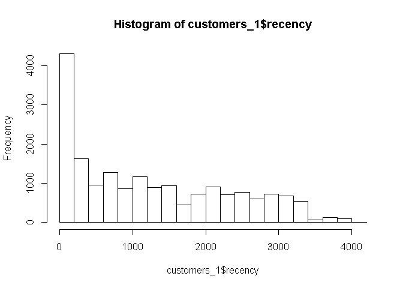
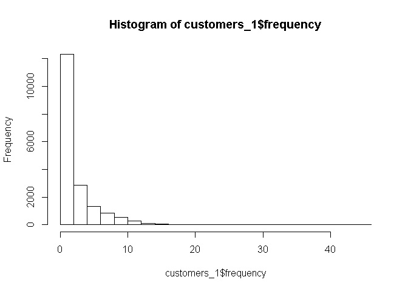
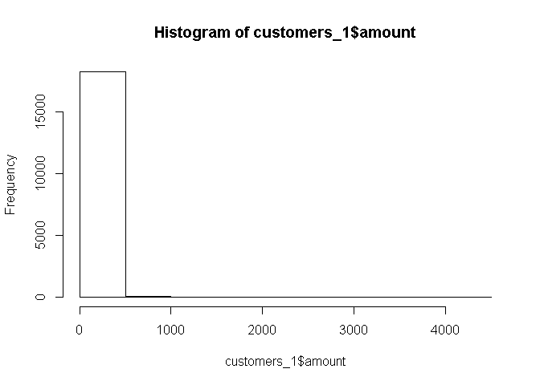
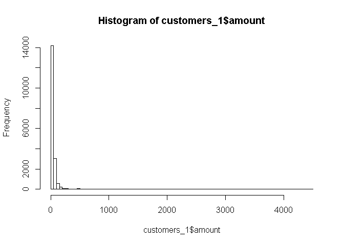
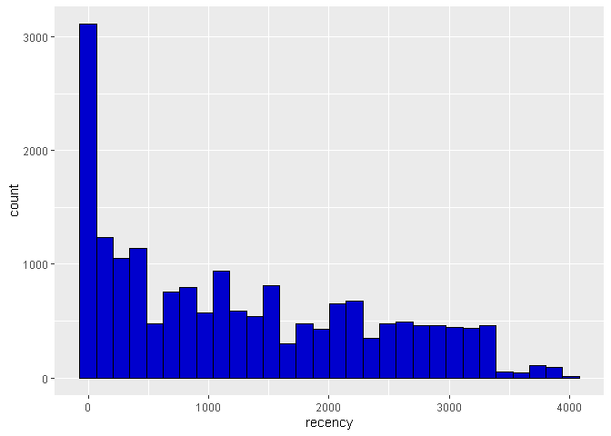
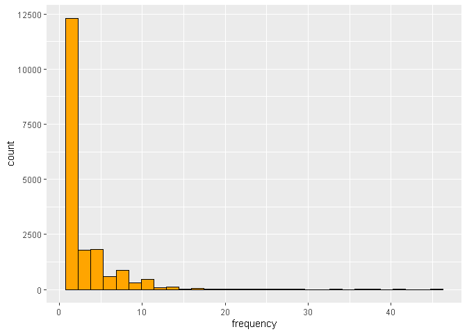
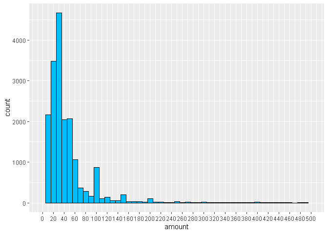
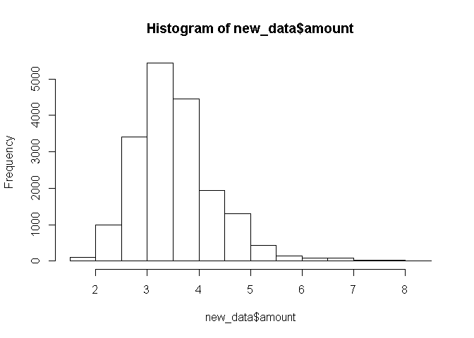
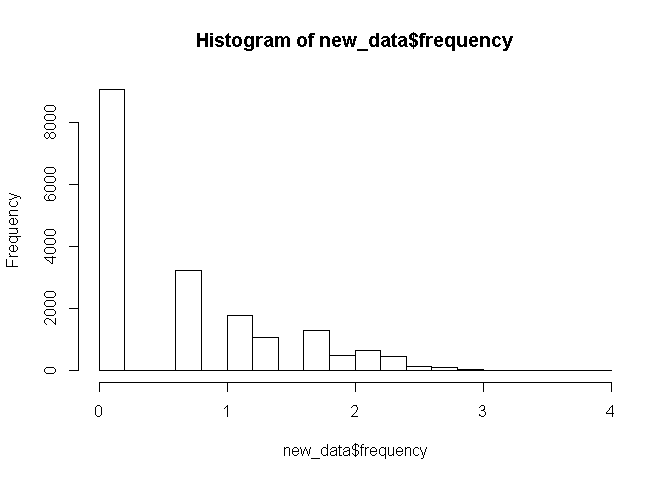
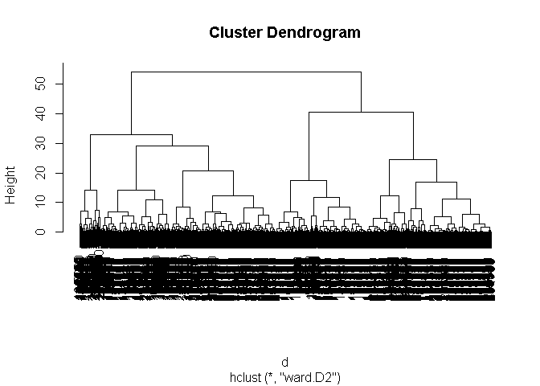

Instructions before starting the quiz 1
---------------------------------------

To validate Module 1 and correctly answer the questions will require
that you perform the following exercise first: take the code in the file
named module1.R, and modify it such that

1.  the segmentation variable “frequency” is replaced by its log (before
    it is scaled), and
2.  you select a 5-segment solution instead of a 9-segment solution.

You’ll be asked to answer these questions :
-------------------------------------------

-   What is the size of the largest segment?

-   What is the average purchase amount of the segment which contains,
    on average, the customers who have made their last purchase the most
    recently?

-   Of the five following criteria to determine the best number of
    segments, which one is the least relevant?

-   Does customer \#260 belongs to the same segment than customer
    \#5920?

-   Looking at the average profile of segment 1, would you say that
    members of this segment are typically…(you’ll have to choose the
    right proposition).

### — COMPUTING RECENCY, FREQUENCY, MONETARY VALUE ———

### Loading the dataset

``` r
data = read.delim(file = 'purchases.txt', header = FALSE, sep = '\t', dec = '.')
```

#### Display the data before transformation

``` r
head(data)
```

    ##     V1  V2         V3
    ## 1  760  25 2009-11-06
    ## 2  860  50 2012-09-28
    ## 3 1200 100 2005-10-25
    ## 4 1420  50 2009-07-09
    ## 5 1940  70 2013-01-25
    ## 6 1960  40 2013-10-29

``` r
str(data)
```

    ## 'data.frame':    51243 obs. of  3 variables:
    ##  $ V1: int  760 860 1200 1420 1940 1960 2620 3050 3120 3260 ...
    ##  $ V2: num  25 50 100 50 70 40 30 50 150 45 ...
    ##  $ V3: Factor w/ 1879 levels "2005-01-02","2005-01-04",..: 668 1099 93 622 1160 1319 121 251 173 798 ...

### Transforming the dataset

#### Add headers and interpret the last column as a date, extract year of purchase

``` r
colnames(data) = c('customer_id', 'purchase_amount', 'date_of_purchase')
data$date_of_purchase = as.Date(data$date_of_purchase, "%Y-%m-%d")
data$days_since       = as.numeric(difftime(time1 = "2016-01-01",
                                            time2 = data$date_of_purchase,
                                            units = "days"))
```

Function difftime calculates a difference of two date/time.

### Exploring the transformed dataset

#### Dataset size

``` r
dim(data)
```

    ## [1] 51243     4

##### Display the data after transformation

``` r
head(data)
```

    ##   customer_id purchase_amount date_of_purchase days_since
    ## 1         760              25       2009-11-06  2247.2083
    ## 2         860              50       2012-09-28  1190.2083
    ## 3        1200             100       2005-10-25  3720.2083
    ## 4        1420              50       2009-07-09  2367.2083
    ## 5        1940              70       2013-01-25  1071.2083
    ## 6        1960              40       2013-10-29   794.2083

``` r
summary(data)
```

    ##   customer_id     purchase_amount   date_of_purchase       days_since      
    ##  Min.   :    10   Min.   :   5.00   Min.   :2005-01-02   Min.   :   1.208  
    ##  1st Qu.: 57720   1st Qu.:  25.00   1st Qu.:2009-01-17   1st Qu.: 733.208  
    ##  Median :102440   Median :  30.00   Median :2011-11-23   Median :1500.208  
    ##  Mean   :108935   Mean   :  62.34   Mean   :2011-07-14   Mean   :1632.148  
    ##  3rd Qu.:160525   3rd Qu.:  60.00   3rd Qu.:2013-12-29   3rd Qu.:2540.208  
    ##  Max.   :264200   Max.   :4500.00   Max.   :2015-12-31   Max.   :4016.208

### Computing key marketing indicators with RSTUDIO

#### Let’s compute key marketing indicators: Recency, Frequency, and Monetary Value (average purchase amount):

``` r
library(dplyr)
```

    ## 
    ## Attaching package: 'dplyr'

    ## The following objects are masked from 'package:stats':
    ## 
    ##     filter, lag

    ## The following objects are masked from 'package:base':
    ## 
    ##     intersect, setdiff, setequal, union

``` r
customer_id_groups <- group_by(data, customer_id) # first groups data by customer_id

customers_1 <- summarise(customer_id_groups,# then summarizes and creates new variables 
                       recency = min(days_since),     # number of days since last purchase
                       frequency = n(),                # number of purchases
                       amount = mean(purchase_amount))  # average purchase amount (monetary value)

head(customers_1)
```

    ## # A tibble: 6 x 4
    ##   customer_id recency frequency amount
    ##         <int>   <dbl>     <int>  <dbl>
    ## 1          10   3829.         1   30  
    ## 2          80    343.         7   71.4
    ## 3          90    758.        10  116. 
    ## 4         120   1401.         1   20  
    ## 5         130   2970.         2   50  
    ## 6         160   2963.         2   30

80 343.2083 7 71.42857

El cliente que tiene el id = 80 su compra más reciente ha sido hace 343
días, con 7 números de compras del 01/01/2005 al 01/01/2016 con un monto
promedio de compras de S/. 71.42.

### Explore the data

``` r
head(customers_1)
```

    ## # A tibble: 6 x 4
    ##   customer_id recency frequency amount
    ##         <int>   <dbl>     <int>  <dbl>
    ## 1          10   3829.         1   30  
    ## 2          80    343.         7   71.4
    ## 3          90    758.        10  116. 
    ## 4         120   1401.         1   20  
    ## 5         130   2970.         2   50  
    ## 6         160   2963.         2   30

``` r
summary(customers_1)
```

    ##   customer_id        recency           frequency          amount       
    ##  Min.   :    10   Min.   :   1.208   Min.   : 1.000   Min.   :   5.00  
    ##  1st Qu.: 81990   1st Qu.: 244.208   1st Qu.: 1.000   1st Qu.:  21.67  
    ##  Median :136430   Median :1070.208   Median : 2.000   Median :  30.00  
    ##  Mean   :137574   Mean   :1253.246   Mean   : 2.782   Mean   :  57.79  
    ##  3rd Qu.:195100   3rd Qu.:2130.208   3rd Qu.: 3.000   3rd Qu.:  50.00  
    ##  Max.   :264200   Max.   :4014.208   Max.   :45.000   Max.   :4500.00

``` r
hist(customers_1$recency)
```



``` r
hist(customers_1$frequency)
```



``` r
hist(customers_1$amount)
```



``` r
hist(customers_1$amount, breaks = 100)
```



#### Doing more data exploration

``` r
library(ggplot2)

ggplot(data=customers_1, aes(recency)) + geom_histogram(color = I('black'), fill= I('blue3'))
```

    ## `stat_bin()` using `bins = 30`. Pick better value with `binwidth`.



``` r
ggplot(data=customers_1, aes(frequency)) + geom_histogram(color = I('black'), fill= I('orange'))
```

    ## `stat_bin()` using `bins = 30`. Pick better value with `binwidth`.



``` r
ggplot(data=customers_1, aes(amount)) + geom_histogram(binwidth = 10, color = I('black'), fill= I('deepskyblue')) +
   scale_x_continuous(limits = c(0, 500),
                     breaks = seq(0, 500, 20))
```

    ## Warning: Removed 167 rows containing non-finite values (stat_bin).

    ## Warning: Removed 2 rows containing missing values (geom_bar).


\#\#\#— PREPARING AND TRANSFORMING DATA ———————-

#### Copying customer data into new data frame

``` r
new_data = customers_1
head(new_data)
```

    ## # A tibble: 6 x 4
    ##   customer_id recency frequency amount
    ##         <int>   <dbl>     <int>  <dbl>
    ## 1          10   3829.         1   30  
    ## 2          80    343.         7   71.4
    ## 3          90    758.        10  116. 
    ## 4         120   1401.         1   20  
    ## 5         130   2970.         2   50  
    ## 6         160   2963.         2   30

#### Remove customer id as a variable, store it as row names

And storing it as row names:

``` r
head(new_data)
```

    ## # A tibble: 6 x 4
    ##   customer_id recency frequency amount
    ##         <int>   <dbl>     <int>  <dbl>
    ## 1          10   3829.         1   30  
    ## 2          80    343.         7   71.4
    ## 3          90    758.        10  116. 
    ## 4         120   1401.         1   20  
    ## 5         130   2970.         2   50  
    ## 6         160   2963.         2   30

``` r
row.names(new_data) = new_data$customer_id
```

    ## Warning: Setting row names on a tibble is deprecated.

``` r
new_data$customer_id = NULL
head(new_data)
```

    ## # A tibble: 6 x 3
    ##   recency frequency amount
    ##     <dbl>     <int>  <dbl>
    ## 1   3829.         1   30  
    ## 2    343.         7   71.4
    ## 3    758.        10  116. 
    ## 4   1401.         1   20  
    ## 5   2970.         2   50  
    ## 6   2963.         2   30

#### Take the log-transform of the amount, and plot

``` r
library(ggplot2)
new_data$amount = log(new_data$amount)
hist(new_data$amount)
```



#### Take the log-transform of the frecuency, and plot

``` r
library(ggplot2)
new_data$frequency = log(new_data$frequency)
hist(new_data$frequency)
```


\#\#\#\# Standardize variables

``` r
new_data = scale(new_data)
head(new_data)
```

    ##        recency   frequency     amount
    ## 10   2.3819788 -0.85366742 -0.2357955
    ## 80  -0.8415073  1.64194738  0.8943622
    ## 90  -0.4577590  2.09938025  1.5238194
    ## 120  0.1368198 -0.85366742 -0.7640251
    ## 130  1.5876660  0.03528851  0.4296952
    ## 160  1.5811931  0.03528851 -0.2357955

Data is now ready to be segmented.

### — RUNNING A HIERARCHICAL SEGMENTATION ——————

#### Compute distance metrics on standardized data

#### This will likely generate an error on most machines

#### d = dist(new\_data)

#### Take a 10% sample

``` r
sample = seq(1, 18417, by = 10)
head(sample)
```

    ## [1]  1 11 21 31 41 51

``` r
customers_sample = customers_1[sample, ]
new_data_sample  = new_data[sample, ]
```

#### Compute distance metrics on standardized data

``` r
d = dist(new_data_sample)
```

#### Perform hierarchical clustering on distance metrics

``` r
c = hclust(d, method="ward.D2")
```

#### Plot de dendogram

``` r
plot(c)
```



#### Cut at 5 segments

``` r
members = cutree(c, k = 5)
head(members)
```

    ##   10  260  510  850 1040 1430 
    ##    1    1    1    2    2    3

``` r
#Muestra el segmento más grande
table(members)
```

    ## members
    ##   1   2   3   4   5 
    ## 408 470 314 555  95

#### Show 30 first customers, frequency table

``` r
members[1:30]
```

    ##   10  260  510  850 1040 1430 1860 2160 2380 2700 3000 3140 3650 3920 4240 4470 
    ##    1    1    1    2    2    3    4    5    2    3    3    1    2    1    1    2 
    ## 4710 4910 5230 5520 5710 5920 6080 6240 6410 6600 6750 6940 7100 7330 
    ##    5    3    2    1    1    5    3    1    3    3    2    2    3    3

``` r
table(members)
```

    ## members
    ##   1   2   3   4   5 
    ## 408 470 314 555  95

#### Show profile of each segment

``` r
aggregate(customers_sample[, 2:4], by = list(members), mean)
```

    ##   Group.1   recency frequency    amount
    ## 1       1 2757.4265  1.117647  35.00041
    ## 2       2  305.5594  5.306383  38.29947
    ## 3       3 1828.5300  3.426752  32.01873
    ## 4       4  758.8462  1.113514  45.24456
    ## 5       5  606.7873  5.494737 311.26964

Groups by segment number the variables (recency, frequency and monetary
value) of the non-normalized customer sample and shows the mean value of
each variable for each segment.

### Analysis

The above table summarizes the diversity of profile existing between the
18,417 customers of the database. For example:

\*Segment 2 has an average recency of 305 days, an average of 5.3
purchases made in the past and an average purchase amount of $38.3.

\*Segment \#5 spends much more in the store whereas segment \#3 spends
much less.

Quiz module 1 - 20% of final grade
----------------------------------

\#\#\#PUNTOS TOTALES DE 5

#### 1.Pregunta 1

#### What is the size of the largest segment?

``` r
table(members)
```

    ## members
    ##   1   2   3   4   5 
    ## 408 470 314 555  95

The largest segment is segment 4, which has 555 customers.

#### 2.Pregunta 2

#### What is the average purchase amount of the segment which contains, on average, the customers who \#\#\#\# have made their last purchase the most recently?

``` r
aggregate(customers_sample[, 2:4], by = list(members), mean)
```

    ##   Group.1   recency frequency    amount
    ## 1       1 2757.4265  1.117647  35.00041
    ## 2       2  305.5594  5.306383  38.29947
    ## 3       3 1828.5300  3.426752  32.01873
    ## 4       4  758.8462  1.113514  45.24456
    ## 5       5  606.7873  5.494737 311.26964

The segment 2 has customers who made their last purchase 305 days ago on
average. For this segment, the average purchase amount is $38.2.

#### 3.Pregunta 3

#### Of the five following criteria to determine the best number of segments, which one is the least relevant?

-   How informative the segment solution is to managers

#### - The number of segmentation variables

-   The number of customers

-   The fact that each segment is clearly different from the other
    clusters

-   The statistical validity of the segment solution, as determined by
    the dendogram

#### 4.Pregunta 4

#### Does customer \#260 belongs to the same segment than customer \#5920?

#### Opción 1: lo convertimos a matriz

``` r
members_matrix <- as.matrix(members)
members_matrix[c('260'), ]
```

    ## 260 
    ##   1

``` r
members_matrix[c('5920'), ]
```

    ## 5920 
    ##    5

#### Opción 2: lo convertimos a dataframe

``` r
members_dataframe <- data.frame(members)
members_dataframe
```

    ##        members
    ## 10           1
    ## 260          1
    ## 510          1
    ## 850          2
    ## 1040         2
    ## 1430         3
    ## 1860         4
    ## 2160         5
    ## 2380         2
    ## 2700         3
    ## 3000         3
    ## 3140         1
    ## 3650         2
    ## 3920         1
    ## 4240         1
    ## 4470         2
    ## 4710         5
    ## 4910         3
    ## 5230         2
    ## 5520         1
    ## 5710         1
    ## 5920         5
    ## 6080         3
    ## 6240         1
    ## 6410         3
    ## 6600         3
    ## 6750         2
    ## 6940         2
    ## 7100         3
    ## 7330         3
    ## 7490         2
    ## 7610         2
    ## 7770         1
    ## 7920         3
    ## 8060         2
    ## 8190         3
    ## 8320         5
    ## 8530         2
    ## 8660         2
    ## 8760         1
    ## 8920         1
    ## 9030         3
    ## 9170         3
    ## 9290         5
    ## 9470         1
    ## 9600         1
    ## 9760         1
    ## 9900         3
    ## 10050        1
    ## 10160        3
    ## 10310        2
    ## 10420        3
    ## 10580        2
    ## 10680        3
    ## 10790        3
    ## 10950        3
    ## 11110        3
    ## 11210        2
    ## 11340        4
    ## 11570        1
    ## 11710        2
    ## 11840        5
    ## 11970        1
    ## 12130        3
    ## 12300        1
    ## 12480        1
    ## 12650        3
    ## 12800        5
    ## 12910        2
    ## 13040        2
    ## 13190        2
    ## 13330        1
    ## 13460        5
    ## 13570        2
    ## 13680        2
    ## 13810        5
    ## 13920        2
    ## 14070        2
    ## 14210        2
    ## 14390        1
    ## 14540        5
    ## 14680        1
    ## 14800        5
    ## 15010        2
    ## 15110        2
    ## 15240        2
    ## 15350        3
    ## 15470        1
    ## 15600        5
    ## 15720        2
    ## 15850        2
    ## 15980        5
    ## 16110        3
    ## 16230        1
    ## 16330        1
    ## 16430        1
    ## 16530        2
    ## 16650        3
    ## 16760        1
    ## 16880        3
    ## 16990        1
    ## 17110        1
    ## 17250        3
    ## 17370        1
    ## 17680        1
    ## 17840        2
    ## 18000        3
    ## 18130        3
    ## 18370        3
    ## 18490        1
    ## 18640        5
    ## 18770        2
    ## 18900        3
    ## 19010        2
    ## 19190        5
    ## 19310        3
    ## 19440        3
    ## 19590        1
    ## 19700        5
    ## 19950        2
    ## 20120        4
    ## 20280        1
    ## 20420        1
    ## 20520        2
    ## 20640        2
    ## 21200        5
    ## 22500        3
    ## 23790        3
    ## 24760        3
    ## 25490        1
    ## 25960        1
    ## 26890        3
    ## 27370        2
    ## 28150        1
    ## 29270        1
    ## 29640        3
    ## 30960        1
    ## 31680        3
    ## 32320        1
    ## 33140        5
    ## 33850        2
    ## 34300        1
    ## 34750        3
    ## 35270        3
    ## 35900        2
    ## 36540        3
    ## 37470        3
    ## 38390        1
    ## 38790        4
    ## 39280        3
    ## 39730        2
    ## 40340        1
    ## 40620        3
    ## 41210        3
    ## 41610        1
    ## 41900        2
    ## 42750        3
    ## 43880        4
    ## 44530        2
    ## 45280        1
    ## 46050        1
    ## 46470        3
    ## 46580        3
    ## 46750        1
    ## 46870        3
    ## 47020        1
    ## 47150        2
    ## 47270        1
    ## 47390        1
    ## 47510        1
    ## 47640        1
    ## 47800        1
    ## 47980        5
    ## 48100        5
    ## 48250        2
    ## 48370        1
    ## 48480        1
    ## 48590        2
    ## 48700        2
    ## 48800        2
    ## 48910        2
    ## 49020        3
    ## 49150        3
    ## 49280        1
    ## 49380        1
    ## 49520        3
    ## 49650        5
    ## 49800        1
    ## 49950        5
    ## 50940        1
    ## 51080        3
    ## 51200        3
    ## 51330        3
    ## 51440        1
    ## 51560        3
    ## 51670        3
    ## 51770        2
    ## 51870        1
    ## 51990        3
    ## 52090        1
    ## 52200        4
    ## 52370        3
    ## 52470        3
    ## 52590        1
    ## 52720        1
    ## 52840        3
    ## 52960        1
    ## 53070        2
    ## 53170        5
    ## 53280        3
    ## 53390        1
    ## 53500        1
    ## 53630        2
    ## 53740        3
    ## 54090        1
    ## 54190        1
    ## 54310        3
    ## 54420        3
    ## 54560        3
    ## 54660        2
    ## 54770        3
    ## 54870        3
    ## 54990        2
    ## 55110        3
    ## 55230        2
    ## 55340        3
    ## 55480        3
    ## 55610        1
    ## 55740        1
    ## 55840        2
    ## 55960        1
    ## 56070        2
    ## 56170        2
    ## 56270        1
    ## 56370        3
    ## 56490        2
    ## 56600        3
    ## 56730        2
    ## 56840        1
    ## 56970        2
    ## 57090        1
    ## 57200        2
    ## 57310        3
    ## 57430        5
    ## 57550        2
    ## 57650        3
    ## 57770        2
    ## 57870        3
    ## 57980        3
    ## 58100        3
    ## 58210        3
    ## 58320        2
    ## 58430        3
    ## 58530        3
    ## 58660        2
    ## 58760        3
    ## 58860        2
    ## 58980        2
    ## 59080        2
    ## 59190        1
    ## 59290        1
    ## 59410        2
    ## 59550        3
    ## 59660        5
    ## 59760        1
    ## 59880        1
    ## 60000        2
    ## 60100        1
    ## 60210        4
    ## 60320        1
    ## 60430        3
    ## 60540        1
    ## 60650        2
    ## 60750        3
    ## 60860        5
    ## 60960        2
    ## 61060        1
    ## 61160        3
    ## 61260        1
    ## 61370        2
    ## 61520        2
    ## 61620        2
    ## 61860        4
    ## 61960        3
    ## 62150        3
    ## 62260        1
    ## 62370        5
    ## 62510        2
    ## 62610        2
    ## 62720        2
    ## 62820        2
    ## 62920        2
    ## 63030        5
    ## 63160        1
    ## 63260        1
    ## 63370        2
    ## 63490        3
    ## 63600        3
    ## 63720        3
    ## 63820        3
    ## 63930        3
    ## 64040        1
    ## 64160        3
    ## 64280        5
    ## 64380        3
    ## 64600        2
    ## 64700        3
    ## 64800        3
    ## 64900        2
    ## 65010        1
    ## 65130        1
    ## 65230        2
    ## 65380        1
    ## 65510        3
    ## 65610        1
    ## 65730        3
    ## 65830        5
    ## 65930        2
    ## 66030        1
    ## 66130        1
    ## 66230        3
    ## 66340        3
    ## 66450        3
    ## 66560        3
    ## 66660        2
    ## 66760        3
    ## 66870        3
    ## 66980        2
    ## 67080        1
    ## 67180        3
    ## 67290        3
    ## 67400        3
    ## 67500        3
    ## 67610        1
    ## 67710        3
    ## 67850        2
    ## 67960        1
    ## 68130        2
    ## 68250        2
    ## 68360        1
    ## 68490        1
    ## 68600        3
    ## 68720        3
    ## 68840        3
    ## 68940        1
    ## 69040        3
    ## 69150        1
    ## 69250        1
    ## 69350        1
    ## 69450        2
    ## 69550        2
    ## 69660        2
    ## 69760        1
    ## 69860        1
    ## 69990        3
    ## 70100        3
    ## 70210        1
    ## 70320        1
    ## 70420        2
    ## 70530        3
    ## 70650        3
    ## 70790        1
    ## 70890        3
    ## 71000        2
    ## 71100        3
    ## 71220        3
    ## 71350        2
    ## 71490        2
    ## 71610        3
    ## 71710        1
    ## 71820        1
    ## 71940        1
    ## 72060        1
    ## 72170        1
    ## 72270        1
    ## 72370        4
    ## 72480        3
    ## 72580        2
    ## 72680        3
    ## 72790        3
    ## 72890        1
    ## 73010        2
    ## 73110        1
    ## 73210        4
    ## 73310        1
    ## 73420        3
    ## 73530        1
    ## 73630        3
    ## 73730        3
    ## 73830        1
    ## 73940        3
    ## 74070        2
    ## 74190        1
    ## 74300        1
    ## 74410        3
    ## 74510        1
    ## 74630        3
    ## 74730        1
    ## 74830        2
    ## 74940        1
    ## 75050        3
    ## 75160        1
    ## 75260        1
    ## 75360        2
    ## 75480        1
    ## 75600        4
    ## 75710        1
    ## 75810        1
    ## 75930        1
    ## 76030        1
    ## 76160        1
    ## 76300        1
    ## 76420        1
    ## 76530        3
    ## 76630        3
    ## 76740        1
    ## 76840        1
    ## 76950        3
    ## 77070        3
    ## 77180        1
    ## 77300        1
    ## 77410        1
    ## 77570        1
    ## 77680        1
    ## 77790        1
    ## 77890        3
    ## 77990        1
    ## 78100        2
    ## 78200        3
    ## 78300        1
    ## 78400        3
    ## 78510        1
    ## 78610        1
    ## 78710        2
    ## 78860        1
    ## 78960        1
    ## 79070        2
    ## 79170        1
    ## 79360        2
    ## 79480        3
    ## 79610        2
    ## 79720        2
    ## 79820        3
    ## 80040        1
    ## 80160        3
    ## 80260        1
    ## 80380        2
    ## 80490        3
    ## 80590        2
    ## 80700        1
    ## 80810        3
    ## 80920        2
    ## 81020        1
    ## 81150        3
    ## 81280        1
    ## 81400        3
    ## 81520        1
    ## 81620        1
    ## 81750        1
    ## 81850        1
    ## 81950        5
    ## 82050        1
    ## 82170        1
    ## 82280        3
    ## 82400        3
    ## 82500        2
    ## 82630        1
    ## 82760        1
    ## 82910        3
    ## 83040        3
    ## 83180        1
    ## 83300        1
    ## 83400        1
    ## 83500        5
    ## 83620        2
    ## 83750        1
    ## 83880        1
    ## 83990        3
    ## 84120        3
    ## 84220        1
    ## 84350        1
    ## 84470        1
    ## 84570        1
    ## 84700        1
    ## 84800        1
    ## 84930        1
    ## 85040        2
    ## 85140        2
    ## 85290        3
    ## 85420        2
    ## 85520        3
    ## 85640        1
    ## 85740        1
    ## 85880        3
    ## 85980        1
    ## 86100        1
    ## 86220        3
    ## 86330        2
    ## 86450        3
    ## 86550        1
    ## 86650        3
    ## 86770        1
    ## 86870        3
    ## 86970        1
    ## 87090        2
    ## 87190        1
    ## 87300        3
    ## 87400        3
    ## 87550        2
    ## 87720        1
    ## 87820        3
    ## 87930        3
    ## 88030        3
    ## 88130        3
    ## 88370        2
    ## 88480        2
    ## 88580        3
    ## 88680        1
    ## 88820        3
    ## 88980        3
    ## 89080        2
    ## 89220        1
    ## 89320        3
    ## 89430        1
    ## 89550        3
    ## 89670        1
    ## 89770        3
    ## 89900        2
    ## 90010        3
    ## 90110        1
    ## 90230        2
    ## 90330        2
    ## 90430        2
    ## 90530        4
    ## 90640        1
    ## 90760        1
    ## 90860        3
    ## 90980        5
    ## 91080        1
    ## 91220        5
    ## 91350        1
    ## 91460        3
    ## 91560        1
    ## 91660        1
    ## 91760        2
    ## 91860        1
    ## 91980        3
    ## 92120        1
    ## 92230        1
    ## 92340        1
    ## 92450        3
    ## 92550        1
    ## 92680        1
    ## 92780        1
    ## 92890        1
    ## 92990        1
    ## 93130        1
    ## 93250        1
    ## 93380        2
    ## 93490        4
    ## 93640        1
    ## 93770        1
    ## 93910        3
    ## 94030        1
    ## 94140        1
    ## 94250        1
    ## 94360        2
    ## 94460        1
    ## 94560        2
    ## 94670        1
    ## 94790        3
    ## 94910        1
    ## 95010        3
    ## 95120        1
    ## 95220        2
    ## 95330        3
    ## 95440        1
    ## 95540        3
    ## 95650        1
    ## 95790        3
    ## 95890        3
    ## 95990        3
    ## 96110        1
    ## 96300        2
    ## 96410        1
    ## 96510        3
    ## 96620        5
    ## 96730        1
    ## 96860        2
    ## 96970        2
    ## 97070        1
    ## 97170        1
    ## 97270        1
    ## 97470        4
    ## 97590        2
    ## 97710        3
    ## 97810        1
    ## 97960        1
    ## 98090        3
    ## 98190        2
    ## 98300        2
    ## 98450        3
    ## 98550        5
    ## 98680        3
    ## 98780        3
    ## 98910        2
    ## 99020        5
    ## 99130        2
    ## 99250        2
    ## 99370        3
    ## 99480        2
    ## 99620        3
    ## 99740        1
    ## 99840        1
    ## 99960        5
    ## 100060       1
    ## 100180       5
    ## 100280       2
    ## 100380       1
    ## 100510       1
    ## 100610       1
    ## 100710       3
    ## 100810       3
    ## 100930       1
    ## 101030       2
    ## 101150       2
    ## 101250       1
    ## 101350       1
    ## 101450       1
    ## 101560       3
    ## 101670       2
    ## 101810       1
    ## 101910       1
    ## 102020       2
    ## 102130       3
    ## 102230       3
    ## 102330       1
    ## 102430       1
    ## 102550       3
    ## 102670       3
    ## 102780       3
    ## 102880       3
    ## 102980       1
    ## 103110       1
    ## 103220       1
    ## 103320       4
    ## 103420       5
    ## 103540       1
    ## 103660       3
    ## 103760       2
    ## 103870       3
    ## 103970       3
    ## 104100       1
    ## 104210       1
    ## 104310       3
    ## 104410       3
    ## 104510       2
    ## 104610       3
    ## 104710       1
    ## 104890       1
    ## 105020       1
    ## 105140       2
    ## 105250       1
    ## 105370       3
    ## 105470       1
    ## 105580       2
    ## 105680       1
    ## 105780       1
    ## 105900       1
    ## 106020       1
    ## 106130       3
    ## 106260       1
    ## 106360       3
    ## 106490       5
    ## 106590       3
    ## 106700       1
    ## 106820       1
    ## 106920       3
    ## 107060       3
    ## 107160       1
    ## 107270       4
    ## 107370       3
    ## 107470       3
    ## 107570       1
    ## 107680       4
    ## 107830       3
    ## 107950       2
    ## 108060       2
    ## 108160       3
    ## 108310       5
    ## 108420       3
    ## 108530       3
    ## 108630       2
    ## 108780       4
    ## 108890       1
    ## 109000       1
    ## 109180       2
    ## 109280       3
    ## 109390       2
    ## 109500       5
    ## 109600       2
    ## 109700       1
    ## 109800       1
    ## 109900       1
    ## 110030       2
    ## 110130       1
    ## 110240       1
    ## 110340       2
    ## 110440       3
    ## 110540       3
    ## 110640       2
    ## 110760       3
    ## 110860       3
    ## 110990       1
    ## 111100       3
    ## 111200       2
    ## 111330       2
    ## 111440       1
    ## 111550       1
    ## 111690       1
    ## 111790       2
    ## 111890       1
    ## 111990       4
    ## 112100       2
    ## 112200       4
    ## 112300       3
    ## 112430       1
    ## 112530       3
    ## 112660       1
    ## 112780       1
    ## 112890       2
    ## 112990       3
    ## 113100       3
    ## 113200       3
    ## 113300       1
    ## 113410       1
    ## 113510       1
    ## 113620       1
    ## 113720       3
    ## 113830       3
    ## 113950       2
    ## 114090       2
    ## 114200       1
    ## 114320       3
    ## 114430       1
    ## 114530       1
    ## 114640       2
    ## 114760       1
    ## 114880       1
    ## 115000       2
    ## 115120       1
    ## 115220       1
    ## 115340       1
    ## 115440       5
    ## 115630       1
    ## 115740       5
    ## 115850       3
    ## 115950       1
    ## 116050       5
    ## 116170       3
    ## 116300       1
    ## 116420       3
    ## 116520       3
    ## 116630       3
    ## 116740       2
    ## 116850       5
    ## 116970       1
    ## 117090       2
    ## 117220       3
    ## 117330       3
    ## 117440       3
    ## 117560       1
    ## 117670       1
    ## 117790       1
    ## 117890       3
    ## 118050       2
    ## 118170       1
    ## 118310       2
    ## 118440       1
    ## 118550       3
    ## 118650       2
    ## 118760       2
    ## 118870       5
    ## 118970       1
    ## 119080       1
    ## 119230       2
    ## 119340       1
    ## 119450       1
    ## 119550       2
    ## 119650       3
    ## 119760       1
    ## 119910       1
    ## 120030       1
    ## 120130       2
    ## 120240       1
    ## 120340       1
    ## 120440       3
    ## 120560       3
    ## 120680       3
    ## 120800       1
    ## 120920       3
    ## 121030       1
    ## 121150       4
    ## 121260       2
    ## 121390       3
    ## 121490       2
    ## 121600       3
    ## 121810       1
    ## 121920       2
    ## 122030       3
    ## 122160       2
    ## 122260       2
    ## 122410       4
    ## 122560       2
    ## 122670       1
    ## 122770       1
    ## 122900       3
    ## 123010       1
    ## 123120       3
    ## 123220       3
    ## 123330       2
    ## 123430       1
    ## 123560       1
    ## 123660       2
    ## 123770       2
    ## 123900       3
    ## 124020       1
    ## 124130       5
    ## 124230       1
    ## 124390       2
    ## 124500       1
    ## 124600       1
    ## 124700       1
    ## 124810       1
    ## 124920       1
    ## 125020       4
    ## 125180       3
    ## 125310       1
    ## 125430       4
    ## 125560       2
    ## 125870       2
    ## 125970       3
    ## 126350       1
    ## 126570       3
    ## 126680       1
    ## 126970       1
    ## 127120       1
    ## 127220       3
    ## 127340       3
    ## 127470       1
    ## 127590       3
    ## 127690       1
    ## 127840       3
    ## 127950       2
    ## 128070       2
    ## 128170       2
    ## 128360       3
    ## 128470       1
    ## 128580       3
    ## 128730       1
    ## 128900       2
    ## 129000       1
    ## 129110       3
    ## 129220       1
    ## 129440       2
    ## 129540       3
    ## 129660       2
    ## 129760       1
    ## 129920       1
    ## 130030       2
    ## 130230       5
    ## 130350       1
    ## 130460       3
    ## 130570       3
    ## 130690       3
    ## 130790       1
    ## 130890       2
    ## 131020       3
    ## 131170       2
    ## 131380       2
    ## 131490       3
    ## 131650       1
    ## 131820       4
    ## 131980       2
    ## 132120       3
    ## 132230       3
    ## 132350       5
    ## 132450       1
    ## 132580       1
    ## 132680       2
    ## 132790       1
    ## 132970       1
    ## 133080       5
    ## 133230       5
    ## 133340       1
    ## 133450       1
    ## 133560       1
    ## 133660       1
    ## 133780       1
    ## 133910       3
    ## 134010       2
    ## 134120       2
    ## 134220       5
    ## 134340       2
    ## 134450       3
    ## 134550       3
    ## 134650       2
    ## 134770       5
    ## 134870       3
    ## 134990       4
    ## 135160       4
    ## 135300       1
    ## 135440       3
    ## 135570       4
    ## 135680       2
    ## 135790       2
    ## 135900       4
    ## 136000       1
    ## 136100       4
    ## 136210       2
    ## 136340       2
    ## 136450       1
    ## 136550       2
    ## 136690       1
    ## 136810       1
    ## 136920       1
    ## 137020       2
    ## 137130       1
    ## 137230       4
    ## 137350       1
    ## 137470       1
    ## 137580       1
    ## 137710       1
    ## 137940       5
    ## 138060       1
    ## 138200       2
    ## 138310       4
    ## 138440       2
    ## 138560       2
    ## 138660       1
    ## 138770       1
    ## 138880       4
    ## 138990       2
    ## 139110       1
    ## 139220       1
    ## 139330       2
    ## 139460       2
    ## 139660       1
    ## 139820       1
    ## 139940       2
    ## 140040       1
    ## 140140       1
    ## 140240       2
    ## 140370       4
    ## 140480       1
    ## 140580       2
    ## 140690       1
    ## 140790       1
    ## 140900       2
    ## 141020       4
    ## 141120       4
    ## 141220       5
    ## 141330       4
    ## 141470       4
    ## 141570       3
    ## 141670       1
    ## 141850       2
    ## 141960       3
    ## 142060       1
    ## 142170       5
    ## 142270       2
    ## 142380       4
    ## 142480       1
    ## 142590       4
    ## 142700       2
    ## 142800       2
    ## 142930       2
    ## 143030       2
    ## 143140       3
    ## 143250       1
    ## 143350       1
    ## 143470       2
    ## 143600       2
    ## 143700       1
    ## 143800       3
    ## 143930       1
    ## 144030       2
    ## 144130       4
    ## 144260       1
    ## 144360       1
    ## 144480       1
    ## 144580       1
    ## 144680       1
    ## 144790       1
    ## 144890       1
    ## 144990       3
    ## 145130       1
    ## 145270       1
    ## 145370       3
    ## 145490       1
    ## 145630       3
    ## 145860       2
    ## 146080       1
    ## 146210       1
    ## 146380       1
    ## 146500       3
    ## 146620       3
    ## 146730       2
    ## 146830       3
    ## 146980       1
    ## 147080       2
    ## 147200       3
    ## 147380       4
    ## 147500       1
    ## 147670       4
    ## 147840       2
    ## 147990       1
    ## 148140       1
    ## 148250       4
    ## 148380       4
    ## 148630       4
    ## 148800       5
    ## 148950       3
    ## 149060       1
    ## 149240       2
    ## 149360       2
    ## 149510       3
    ## 149640       4
    ## 149740       4
    ## 149870       5
    ## 149990       4
    ## 150100       2
    ## 150210       1
    ## 150310       1
    ## 150420       1
    ## 150620       4
    ## 150730       2
    ## 150850       5
    ## 150980       2
    ## 151100       2
    ## 151240       4
    ## 151350       2
    ## 151490       4
    ## 151610       2
    ## 151730       5
    ## 151830       2
    ## 152020       1
    ## 152120       2
    ## 152220       1
    ## 152320       1
    ## 152430       3
    ## 152570       4
    ## 152740       1
    ## 152910       5
    ## 153070       5
    ## 153170       2
    ## 153340       3
    ## 153480       1
    ## 153590       1
    ## 153770       2
    ## 153910       4
    ## 154090       2
    ## 154190       1
    ## 154390       3
    ## 154530       4
    ## 154650       5
    ## 154780       4
    ## 154980       1
    ## 155180       1
    ## 155330       3
    ## 155530       2
    ## 155670       1
    ## 155880       2
    ## 155980       2
    ## 156130       2
    ## 156300       4
    ## 156470       1
    ## 156630       4
    ## 156820       2
    ## 156950       2
    ## 157090       3
    ## 157210       4
    ## 157340       3
    ## 157580       2
    ## 157720       4
    ## 157850       2
    ## 158020       2
    ## 158180       4
    ## 158290       4
    ## 158430       4
    ## 158620       4
    ## 158850       2
    ## 158960       2
    ## 159090       2
    ## 159200       1
    ## 159310       3
    ## 159460       4
    ## 159630       4
    ## 159820       4
    ## 159940       4
    ## 160060       4
    ## 160200       2
    ## 160310       2
    ## 160430       5
    ## 160530       4
    ## 160640       4
    ## 160740       2
    ## 160850       2
    ## 161010       2
    ## 161190       2
    ## 161400       2
    ## 161520       4
    ## 161690       4
    ## 161790       2
    ## 161890       4
    ## 162010       2
    ## 162130       2
    ## 162230       2
    ## 162330       2
    ## 162440       4
    ## 162560       4
    ## 162670       4
    ## 162770       2
    ## 162910       4
    ## 163030       2
    ## 163130       4
    ## 163230       2
    ## 163330       2
    ## 163430       4
    ## 163730       2
    ## 163830       4
    ## 163960       4
    ## 164060       2
    ## 164190       2
    ## 164390       2
    ## 164490       4
    ## 164600       4
    ## 164700       4
    ## 164850       5
    ## 165320       4
    ## 165420       2
    ## 165530       2
    ## 165650       4
    ## 165770       2
    ## 165870       4
    ## 165970       4
    ## 166100       3
    ## 166200       4
    ## 166300       4
    ## 166400       2
    ## 166500       4
    ## 166660       4
    ## 166790       5
    ## 166890       2
    ## 166990       3
    ## 167090       5
    ## 167310       2
    ## 167440       4
    ## 167550       2
    ## 167660       4
    ## 167770       2
    ## 167870       4
    ## 168000       2
    ## 168120       4
    ## 168240       2
    ## 168390       4
    ## 168490       2
    ## 168620       2
    ## 168720       2
    ## 168890       4
    ## 169010       2
    ## 169110       2
    ## 169230       4
    ## 169350       2
    ## 169450       4
    ## 169560       4
    ## 169680       2
    ## 169920       5
    ## 170190       2
    ## 170310       5
    ## 170450       4
    ## 170580       4
    ## 170880       2
    ## 171080       3
    ## 171190       4
    ## 171380       3
    ## 171550       4
    ## 171740       4
    ## 171870       2
    ## 172110       2
    ## 172260       2
    ## 172390       2
    ## 172490       4
    ## 172710       4
    ## 172830       4
    ## 172940       4
    ## 173090       3
    ## 173200       2
    ## 173380       4
    ## 173500       2
    ## 173620       4
    ## 173730       4
    ## 173830       4
    ## 173950       4
    ## 174080       4
    ## 174210       2
    ## 174310       3
    ## 174470       3
    ## 174610       4
    ## 174710       2
    ## 174810       4
    ## 174920       4
    ## 175020       4
    ## 175120       2
    ## 175260       4
    ## 175370       2
    ## 175470       2
    ## 175590       2
    ## 175690       4
    ## 175790       4
    ## 175890       2
    ## 175990       4
    ## 176090       5
    ## 176230       2
    ## 176330       2
    ## 176430       2
    ## 176550       4
    ## 176670       4
    ## 176770       5
    ## 176870       4
    ## 177000       2
    ## 177100       2
    ## 177200       4
    ## 177380       4
    ## 177480       4
    ## 177620       2
    ## 177720       2
    ## 177860       2
    ## 178000       4
    ## 178100       4
    ## 178230       4
    ## 178330       5
    ## 178460       3
    ## 178560       2
    ## 178660       2
    ## 178760       4
    ## 178870       4
    ## 178970       2
    ## 179120       4
    ## 179330       4
    ## 179430       2
    ## 179540       2
    ## 179650       2
    ## 179820       4
    ## 179940       2
    ## 180040       4
    ## 180140       4
    ## 180300       4
    ## 180400       4
    ## 180500       4
    ## 180630       4
    ## 180750       4
    ## 180950       2
    ## 181060       4
    ## 181170       4
    ## 181290       4
    ## 181410       4
    ## 181510       4
    ## 181620       3
    ## 181810       4
    ## 181920       5
    ## 182080       2
    ## 182230       4
    ## 182400       4
    ## 182540       4
    ## 182680       4
    ## 182790       2
    ## 182890       4
    ## 182990       4
    ## 183110       4
    ## 183280       4
    ## 183420       4
    ## 183530       4
    ## 183670       5
    ## 183770       4
    ## 183870       4
    ## 183970       2
    ## 184070       4
    ## 184250       2
    ## 184360       5
    ## 184460       2
    ## 184560       2
    ## 184660       4
    ## 184760       2
    ## 184880       4
    ## 184980       4
    ## 185190       4
    ## 185300       4
    ## 185410       2
    ## 185510       4
    ## 185700       4
    ## 185810       2
    ## 185920       2
    ## 186030       2
    ## 186150       2
    ## 186250       4
    ## 186380       3
    ## 186540       4
    ## 186640       4
    ## 186740       4
    ## 186850       4
    ## 186950       4
    ## 187050       2
    ## 187150       4
    ## 187250       2
    ## 187350       2
    ## 187520       2
    ## 187620       4
    ## 187720       4
    ## 187820       4
    ## 187930       5
    ## 188030       4
    ## 188130       2
    ## 188230       4
    ## 188350       4
    ## 188470       2
    ## 188710       2
    ## 188810       4
    ## 188910       4
    ## 189010       2
    ## 189110       4
    ## 189210       2
    ## 189340       2
    ## 189450       4
    ## 189550       2
    ## 189670       4
    ## 189770       2
    ## 189870       4
    ## 189990       4
    ## 190110       4
    ## 190270       4
    ## 190370       4
    ## 190470       2
    ## 190570       5
    ## 190770       2
    ## 190870       2
    ## 190980       4
    ## 191110       2
    ## 191220       2
    ## 191320       4
    ## 191420       4
    ## 191590       4
    ## 191730       4
    ## 191850       4
    ## 191960       2
    ## 192060       4
    ## 192160       2
    ## 192260       4
    ## 192360       2
    ## 192460       2
    ## 192560       5
    ## 192690       2
    ## 192790       4
    ## 192900       4
    ## 193020       4
    ## 193140       4
    ## 193250       4
    ## 193380       2
    ## 193480       4
    ## 193610       2
    ## 193720       2
    ## 193830       2
    ## 193980       4
    ## 194120       3
    ## 194230       2
    ## 194340       5
    ## 194460       4
    ## 194600       2
    ## 194710       4
    ## 194820       4
    ## 194960       4
    ## 195060       4
    ## 195200       4
    ## 195380       2
    ## 195500       2
    ## 195770       2
    ## 195920       4
    ## 196080       4
    ## 196180       4
    ## 196320       2
    ## 196460       4
    ## 196560       4
    ## 196680       4
    ## 196800       4
    ## 196910       4
    ## 197010       4
    ## 197190       4
    ## 197330       3
    ## 197450       4
    ## 197550       4
    ## 197650       4
    ## 197750       4
    ## 197850       2
    ## 197950       3
    ## 198090       4
    ## 198190       4
    ## 198300       2
    ## 198410       2
    ## 198540       4
    ## 198640       4
    ## 198740       4
    ## 198840       4
    ## 198950       4
    ## 199060       2
    ## 199160       2
    ## 199310       4
    ## 199410       4
    ## 199520       5
    ## 199690       4
    ## 199810       4
    ## 199910       4
    ## 200040       4
    ## 200140       2
    ## 200260       4
    ## 200380       2
    ## 200540       2
    ## 200640       4
    ## 200800       2
    ## 200920       4
    ## 201050       2
    ## 201170       4
    ## 201270       2
    ## 201370       4
    ## 201490       4
    ## 201660       5
    ## 201790       4
    ## 201900       4
    ## 202010       2
    ## 202130       4
    ## 202250       2
    ## 202350       4
    ## 202470       2
    ## 202610       4
    ## 202740       4
    ## 202880       4
    ## 203020       4
    ## 203150       4
    ## 203290       4
    ## 203390       4
    ## 203500       4
    ## 203710       2
    ## 203810       4
    ## 203950       4
    ## 204050       2
    ## 204150       2
    ## 204250       4
    ## 204350       4
    ## 204450       4
    ## 204550       4
    ## 204650       2
    ## 204750       4
    ## 204860       2
    ## 204960       4
    ## 205060       2
    ## 205160       2
    ## 205260       4
    ## 205370       2
    ## 205470       4
    ## 205570       2
    ## 205680       4
    ## 205800       4
    ## 205910       2
    ## 206020       2
    ## 206120       4
    ## 206220       4
    ## 206320       4
    ## 206420       4
    ## 206520       4
    ## 206620       4
    ## 206780       4
    ## 206880       4
    ## 206990       5
    ## 207130       4
    ## 207310       4
    ## 207430       2
    ## 207530       4
    ## 207630       4
    ## 207730       3
    ## 207830       2
    ## 207950       4
    ## 208050       4
    ## 208150       4
    ## 208250       2
    ## 208350       4
    ## 208470       2
    ## 208570       2
    ## 208740       4
    ## 208840       2
    ## 208950       2
    ## 209060       4
    ## 209160       4
    ## 209280       4
    ## 209400       4
    ## 209530       4
    ## 209710       3
    ## 209810       4
    ## 209910       2
    ## 210020       4
    ## 210140       2
    ## 210260       2
    ## 210370       4
    ## 210470       2
    ## 210620       2
    ## 210720       2
    ## 210840       4
    ## 210940       2
    ## 211040       4
    ## 211160       4
    ## 211270       4
    ## 211370       2
    ## 211470       4
    ## 211570       2
    ## 211700       2
    ## 211800       4
    ## 211920       2
    ## 212050       2
    ## 212150       4
    ## 212280       4
    ## 212400       5
    ## 212520       2
    ## 212640       2
    ## 212770       4
    ## 212900       2
    ## 213040       2
    ## 213140       5
    ## 213270       5
    ## 213420       4
    ## 213560       2
    ## 213670       4
    ## 213780       4
    ## 213970       4
    ## 214200       2
    ## 214300       4
    ## 214480       5
    ## 214590       2
    ## 214700       5
    ## 214810       2
    ## 214970       4
    ## 215070       4
    ## 215220       2
    ## 215320       2
    ## 215420       4
    ## 215570       4
    ## 215860       2
    ## 215970       2
    ## 216070       4
    ## 216250       2
    ## 216510       2
    ## 216610       2
    ## 216720       4
    ## 216950       4
    ## 217230       4
    ## 217560       4
    ## 217710       4
    ## 217820       2
    ## 217930       4
    ## 218030       4
    ## 218130       4
    ## 218230       4
    ## 218330       4
    ## 218450       4
    ## 218550       4
    ## 218650       4
    ## 218750       4
    ## 218870       4
    ## 218970       2
    ## 219130       4
    ## 219230       2
    ## 219350       2
    ## 219450       2
    ## 219560       4
    ## 219680       2
    ## 219790       4
    ## 219900       4
    ## 220000       4
    ## 220210       4
    ## 220320       4
    ## 220430       4
    ## 220550       4
    ## 220650       2
    ## 220760       2
    ## 220890       4
    ## 220990       4
    ## 221090       2
    ## 221240       4
    ## 221370       4
    ## 221530       4
    ## 221630       4
    ## 221840       5
    ## 221990       4
    ## 222120       2
    ## 222230       4
    ## 222350       2
    ## 222480       4
    ## 222690       2
    ## 222950       2
    ## 223200       4
    ## 223390       2
    ## 223550       4
    ## 223710       2
    ## 223870       4
    ## 224060       4
    ## 224220       2
    ## 224500       4
    ## 224690       2
    ## 224850       4
    ## 225070       4
    ## 225190       4
    ## 225290       4
    ## 225390       4
    ## 225590       2
    ## 225740       2
    ## 225840       4
    ## 225940       4
    ## 226130       2
    ## 226270       4
    ## 226380       4
    ## 226550       4
    ## 226660       4
    ## 226860       4
    ## 227090       4
    ## 227190       4
    ## 227290       4
    ## 227470       5
    ## 227580       4
    ## 227690       4
    ## 227790       4
    ## 227900       4
    ## 228000       4
    ## 228110       4
    ## 228220       4
    ## 228350       4
    ## 228450       4
    ## 228560       4
    ## 228680       2
    ## 228780       4
    ## 228890       4
    ## 229000       4
    ## 229100       2
    ## 229200       4
    ## 229300       2
    ## 229400       2
    ## 229500       2
    ## 229600       4
    ## 229710       4
    ## 229810       4
    ## 229910       4
    ## 230050       4
    ## 230230       4
    ## 230400       4
    ## 230510       2
    ## 230610       4
    ## 230740       4
    ## 230900       4
    ## 231020       4
    ## 231140       4
    ## 231240       2
    ## 231350       4
    ## 231510       2
    ## 231660       4
    ## 231790       2
    ## 231960       2
    ## 232060       4
    ## 232170       4
    ## 232340       2
    ## 232440       4
    ## 232580       4
    ## 232700       2
    ## 232820       4
    ## 232930       4
    ## 233050       4
    ## 233260       4
    ## 233390       2
    ## 233490       4
    ## 233590       2
    ## 233700       4
    ## 233830       4
    ## 233940       4
    ## 234070       4
    ## 234180       4
    ## 234290       4
    ## 234400       5
    ## 234510       5
    ## 234610       4
    ## 234790       4
    ## 234930       4
    ## 235110       4
    ## 235300       4
    ## 235410       4
    ## 235550       4
    ## 235650       2
    ## 235780       4
    ## 235900       4
    ## 236300       4
    ## 236640       4
    ## 245680       4
    ## 245900       4
    ## 246090       4
    ## 246220       4
    ## 246410       4
    ## 246680       4
    ## 246950       4
    ## 247100       2
    ## 247250       4
    ## 247470       2
    ## 247630       4
    ## 247800       4
    ## 247950       4
    ## 248150       4
    ## 248380       4
    ## 248560       4
    ## 248780       2
    ## 248920       4
    ## 249190       4
    ## 249560       4
    ## 250250       4
    ## 250470       4
    ## 250660       4
    ## 250760       4
    ## 250960       4
    ## 251100       4
    ## 251280       4
    ## 251400       4
    ## 251500       4
    ## 251680       4
    ## 251780       4
    ## 251910       4
    ## 252010       4
    ## 252110       4
    ## 252210       4
    ## 252330       4
    ## 252440       4
    ## 252550       4
    ## 252650       4
    ## 252780       4
    ## 252880       4
    ## 253070       4
    ## 253170       4
    ## 253330       4
    ## 253430       4
    ## 253530       4
    ## 253630       4
    ## 253730       4
    ## 253830       4
    ## 253930       4
    ## 254030       4
    ## 254130       4
    ## 254230       4
    ## 254330       4
    ## 254430       4
    ## 254530       4
    ## 254660       4
    ## 254760       4
    ## 254860       4
    ## 254960       4
    ## 255060       4
    ## 255160       4
    ## 255280       4
    ## 255380       2
    ## 255490       4
    ## 255590       4
    ## 255690       4
    ## 255800       4
    ## 255920       4
    ## 256040       4
    ## 256150       4
    ## 256250       4
    ## 256360       4
    ## 256460       4
    ## 256560       4
    ## 256660       4
    ## 256780       4
    ## 256880       4
    ## 256990       4
    ## 257090       4
    ## 257190       4
    ## 257290       4
    ## 257400       4
    ## 257500       4
    ## 257600       4
    ## 257710       4
    ## 257820       4
    ## 257920       4
    ## 258020       4
    ## 258130       4
    ## 258230       4
    ## 258330       4
    ## 258450       4
    ## 258690       5
    ## 258790       4
    ## 258890       4
    ## 259000       4
    ## 259130       4
    ## 259230       4
    ## 259340       4
    ## 259440       4
    ## 259540       4
    ## 259640       4
    ## 259750       4
    ## 259870       4
    ## 259980       4
    ## 260090       4
    ## 260200       4
    ## 260310       4
    ## 260440       4
    ## 260550       4
    ## 260650       4
    ## 260750       4
    ## 260850       4
    ## 260960       4
    ## 261060       4
    ## 261170       4
    ## 261280       4
    ## 261380       4
    ## 261520       4
    ## 261650       4
    ## 261760       4
    ## 261880       4
    ## 261980       4
    ## 262110       4
    ## 262220       4
    ## 262320       4
    ## 262440       4
    ## 262540       4
    ## 262640       5
    ## 262770       4
    ## 262880       4
    ## 263030       4
    ## 263160       4
    ## 263320       4
    ## 263430       4
    ## 263630       4

``` r
members_dataframe[620, ]
```

    ## [1] 1

``` r
members_dataframe['5920', ]
```

    ## [1] 5

No, customer \#260 and customer \#5920 belong to different segments.

#### 5.Pregunta 5

#### Looking at the average profile of segment 1, would you say that members of this segment are \#\#\#\# typically…

``` r
aggregate(customers_sample[, 2:4], by = list(members), mean)
```

    ##   Group.1   recency frequency    amount
    ## 1       1 2757.4265  1.117647  35.00041
    ## 2       2  305.5594  5.306383  38.29947
    ## 3       3 1828.5300  3.426752  32.01873
    ## 4       4  758.8462  1.113514  45.24456
    ## 5       5  606.7873  5.494737 311.26964

-   Recurring customers with the best recency of all segments

-   Recently acquired customers who have made few purchases so far

-   Customers who do not spend much money on average, but are very loyal

-   Extremely profitable customers

#### -Customers with poor prospects in terms of loyalty and profitability, due to the few purchases they have made so far.

The member of segment \#1 has an average recency of 2757 days (7.5
years) with an average frequency of about 1.1 and an average purchase
amount of $35. It seems that the member of this segment were one-time
shopper in this store and that it’s unlikely that they will return. They
are customers with poor prospects in terms of loyalty and profitability,
due to the few purchases they have made so far.
